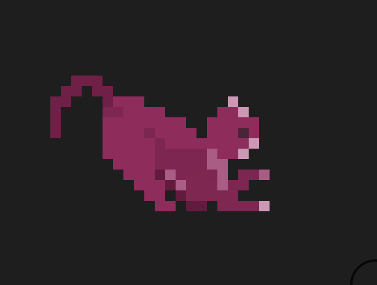
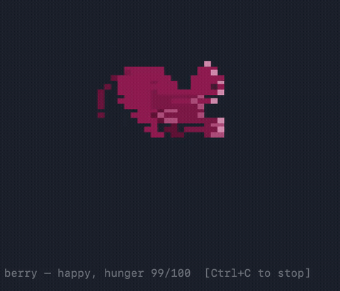

# berry

[](https://github.com/ashmitrrr/berry/actions/workflows/ci.yml)



berry is a tiny pixel-art cat that lives in your terminal and your menu bar.
It'll do this as simply as it can: no accounts, no server, no Electron --
just a `.venv` and your Mac.

Feed it, watch it animate, and it'll remind you about things.



berry reacts to what you're actually doing: it gets
hungry the longer you ignore it, it runs when your CPU spikes, and it
falls asleep when you're away — or when you tell it to, which also puts
your actual Mac to sleep.

Reminders work the same way. Instead of a plain macOS notification,
berry pops up as itself — sprite, speech bubble, and all — so it still
feels like your pet talking to you, not your OS.

## Installing

> [!NOTE]
> berry is macOS-only for now — it leans on `launchd`, `pmset`, and
> AppKit for the background service, sleep control, and menu bar UI.

### Homebrew

```sh
brew tap ashmitrrr/berry
brew trust ashmitrrr/berry
brew install berry
brew services start ashmitrrr/berry/berry
```

> [!NOTE]
> `brew trust` is a one-time confirmation Homebrew requires for any
> third-party tap (not specific to berry) — it'll prompt you the first
> time you install from a tap that isn't `homebrew-core`.
>
> The first install builds a couple of Python C extensions from source
> (Pillow, PyObjC), so it can take a few minutes. That's normal — later
> updates will be much faster.
>
> `brew services start` is what actually launches the menu bar app and
> keeps it running across reboots. If you'd rather run it manually
> instead, skip that line and use `berry menubar` directly.

### Manual

Good for testing before the tap is set up, or for hacking on berry itself.

```sh
git clone https://github.com/ashmitrrr/berry
cd berry

python3 -m venv .venv
source .venv/bin/activate
pip install -e .
```

> [!NOTE]
> Keep the clone somewhere outside `~/Documents`, `~/Desktop`, or iCloud
> Drive. macOS blocks background services from reading files in those
> folders unless the app has Full Disk Access, and berry's launchd agent
> will silently fail to start if it can't read its own `.venv`.

## Usage

`berry status`

Yeah, that's most of it. Everything else builds on top.

### Commands

| Command                       | Function                                       |
| ------------------------------ | ----------------------------------------------- |
| `berry status`                 | Show your pet and its current mood             |
| `berry feed`                   | Feed it — resets hunger, makes it happy        |
| `berry watch`                  | Watch it animate live in your terminal         |
| `berry menubar`                | Run it as an animated icon in your menu bar    |
| `berry nap`                    | Pet goes to sleep, and so does your Mac        |
| `berry wake`                   | Wake it manually (menu bar mode does this on its own) |
| `berry remind "text" "when"`   | Set a reminder — `"in 10m"`, `"in 2h"`, or `"15:30"` |
| `berry reminders`              | List everything still pending                 |
| `berry install`                | Run reminder checks in the background (`launchd`) |
| `berry uninstall`              | Stop the background service                    |

### Mood

berry's mood isn't scripted — it's read off your actual machine:

| Mood      | Trigger                                    |
| --------- | ------------------------------------------- |
| `idle`    | Default resting state                       |
| `happy`   | Hunger above 70                             |
| `hungry`  | Hunger below 20 — feed it                   |
| `running` | CPU usage above 50%                         |
| `sleeping`| Away for 6+ hours, or after `berry nap`     |

Hunger drains faster while you're away from the keyboard (5+ minutes idle)
than while you're actively using your Mac.

### Configuration

Hunger drains at a default rate of 8/hour. To adjust it, create
`~/.berry/config.json`:

```json
{
  "hunger_decay_per_hour": 20.0
}
```

If the file is missing or invalid, berry falls back to the default rate.

### Menu bar mode

```sh
berry menubar
```

Runs berry as a live animated icon next to your clock — it cycles frames,
switches mood on its own, and reacts to your Mac waking up from sleep by
waking itself up too. Click it for a quick Feed / Status menu.

Leave it running in its own terminal tab, or background it with
`berry menubar &`.

### Reminders

```sh
berry remind "check the oven" "in 10m"
```

Reminders are stored in `~/.berry/reminders.json`. On their own they just
sit there — you need something actively checking them:

- `berry install` registers a `launchd` agent that checks every 60
  seconds, in the background, no terminal required. This is the intended
  way to run it.
- `berry daemon` runs the same check in the foreground, useful for
  debugging.

When one fires, berry shows up as a small floating popup near your menu
bar — sprite and message — instead of a plain system notification. If
that fails for any reason (no display, etc.), it falls back to a native
macOS notification automatically.

## How it works

Sprites are rendered as real colored pixel art directly in your terminal
using the half-block trick — each character cell shows two stacked
pixels via `▀`, one color as foreground and one as background. No
images, no GUI, just Unicode and truecolor.

The menu bar icon is the same sprite set, cropped and scaled down with
nearest-neighbor interpolation to stay crisp at 20×20 / 40×40.

Idle time, CPU load, and wake/sleep events are all read straight from
macOS (`ioreg`, `psutil`, `NSWorkspace`) — there's no polling loop
pretending to be a pet, it's actually watching your machine.

## Credits

Cat art based on the [Pet Cats Pack](https://luizmelo.itch.io/pet-cat-pack)
by LuizMelo (CC0), recolored.

## License

MIT — see [LICENSE](LICENSE).
